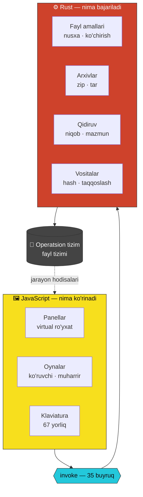
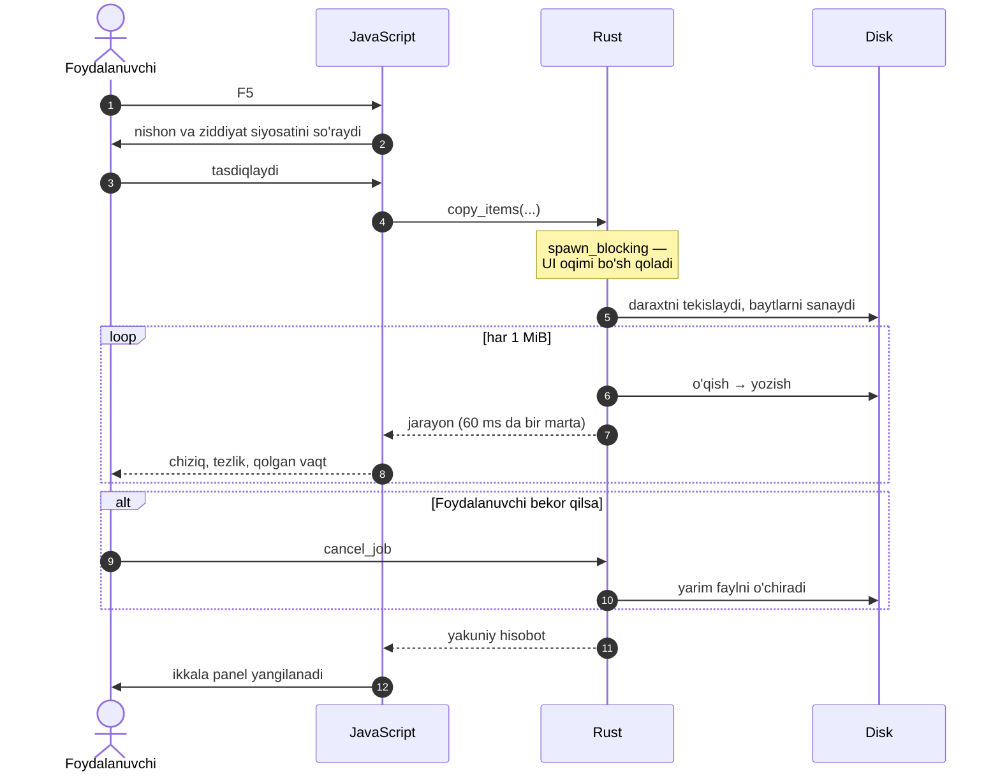
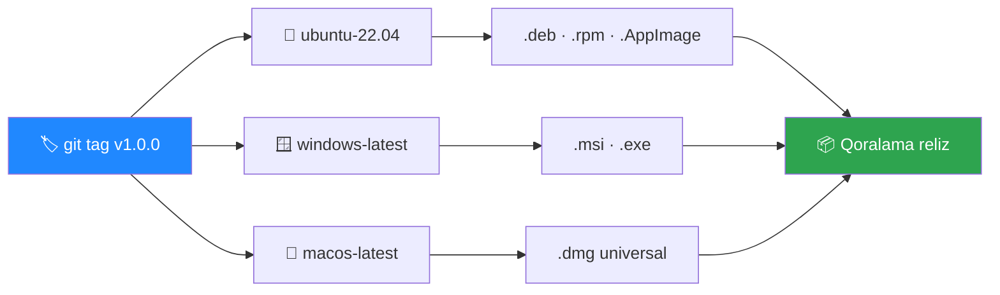

<div align="center">


# Total Commander

### Ikki panelli ish stoli fayl menejeri

*Klaviatura uchun yaratilgan · Rust yadrosi · 6 MB binar*

<br>


</div>

<br>

---

## Bu nima?

Fayllar bilan **klaviatura orqali** ishlash uchun ikki panelli menejer. Bir panelda
manba, ikkinchisida nishon — nusxalash, ko'chirish, arxivlash va qidirish sichqonchaga
tegmasdan bajariladi.

> **Ilhom manbai** — Christian Ghisler 1993-yilda yozgan *Total Commander*
> (o'shanda *Windows Commander*). Undan olingan g'oyalar: ikki panel, `F3`–`F8`
> tugmalari, `Space`/`Insert` bilan belgilash, harf yozib tezkor qidiruv, `Tab` bilan
> panel almashtirish. Bu loyiha uning qayta yozilgan, zamonaviy va **ochiq** varianti.

<br>

<div align="center">

```
┌────────────────────────────────────────────────────────────────────────────┐
│ ▦  Total Commander            22:05:14  23-08-2026 │ ☰  👁  ⚙ │  ─  □  ✕  │
├─────────────────────────────────┬──────────────────────────────────────────┤
│ ▤ /   249.698.300 k dan 161.5…⟳ │ ▤ /   249.698.300 k dan 161.5…        ⟳ │
│ / › home › anonim               │ / › home › anonim › Hujjatlar            │
├────────────────────────┬────────┼────────────────────────┬─────────────────┤
│ Nomi                   │ Sana   │ Nomi                   │ Sana            │
├────────────────────────┼────────┼────────────────────────┼─────────────────┤
│ ..                     │        │ ..                     │                 │
│ 📁 Hujjatlar           │ 23.08. │ 📁 loyihalar           │ 21.08.2026      │
│ 📁 Musiqa              │ 22.08. │ 📘 hisobot.docx        │ 19.08.2026      │
│ 🟧 index.html          │ 23.08. │ 🟥 taqdimot.pdf        │ 18.08.2026      │
│ 🟨 app.js              │ 23.08. │ 🟩 jadval.xlsx         │ 17.08.2026      │
│ 🟦 main.ts             │ 23.08. │ 🟪 qo'shiq.mp3         │ 16.08.2026      │
├────────────────────────┴────────┼────────────────────────┴─────────────────┤
│ 0 k / 302 k — 0 / 4 fayl        │ 0 k / 1.2 M — 0 / 8 fayl                 │
└─────────────────────────────────┴──────────────────────────────────────────┘
```

</div>

<br>

---

## Nima qiladi va nima qilmaydi

<table width="100%">
<tr>
<th width="50%" align="center">✅ &nbsp;Qiladi</th>
<th width="50%" align="center">❌ &nbsp;Qilmaydi</th>
</tr>
<tr>
<td width="50%" valign="top" align="center">

- Ikki panelda fayl boshqarish
- Nusxalash, ko'chirish, o'chirish — **bekor qilinadigan**
- Ko'rish (matn · kod · hex · rasm) va tahrirlash
- `zip` · `tar` · `tar.gz` arxivlash va chiqarish
- Mazmun bo'yicha qidirish, regex bilan ham
- Papkalarni sinxronlash va solishtirish
- Ommaviy nom o'zgartirish
- MD5 · SHA-256 · SHA-512 · CRC32
- Fayllarni bo'laklash va birlashtirish
- 232 kengaytma uchun rangli ikonka
- Uchta mavzu, moslashuvchan interfeys

</td>
<td width="50%" valign="top" align="center">

- **Internetga chiqmaydi** — FTP, SFTP, bulut yo'q
- **`.rar` va `.7z` o'qimaydi** — litsenziya talab qiladi
- Telemetriya yig'maydi, hech narsa yubormaydi
- Plaginlar tizimi yo'q
- Fayllarni indekslamaydi, fon xizmati yo'q
- Mobil qurilmalarda ishlamaydi
- Diskni formatlash kabi tizim amallarini bajarmaydi

</td>
</tr>
</table>

<br>

---

## Qanday ishlaydi

Dastur **ikki qatlamdan** iborat. Ular orasidagi chegara juda aniq:
**JavaScript diskka umuman tegmaydi**, Rust esa piksel chizmaydi.



<br>

<table width="100%">
<tr>
<th width="50%" align="center">⚙️ &nbsp;Rust nima qiladi</th>
<th width="50%" align="center">🖼️ &nbsp;JavaScript nima qiladi</th>
</tr>
<tr>
<td width="50%" valign="top" align="center">

**Butun ish qismi — 2 262 qator**

- Papka o'qish, disklar, atributlar, ruxsatlar
- Nusxalash dvigateli: 1 MiB buferli **oqim**,
  daraxtni tekislash, beshta ziddiyat siyosati
- Bekor qilish: umumiy `AtomicBool`, buferlar
  orasida tekshiriladi, yarim fayl o'chiriladi
- `zip`/`tar`/`tar.gz` — yo'l-traversal himoyasi bilan
- Qidiruv: niqob, mazmun, filtr, oqimli natija
- Kodlashni aniqlash, hex dump, nazorat yig'indilari
- Har bir og'ir amal **`spawn_blocking`** da,
  alohida OS oqimida

</td>
<td width="50%" valign="top" align="center">

**Faqat interfeys — 3 940 qator**

- Virtual ro'yxat: 100 000 fayl → ~30 DOM tuguni
- Klaviatura xaritasi, kontekst menyular
- Oynalar: ko'ruvchi, muharrir, qidiruv, arxivlagich
- Jarayon chizig'i, tezlik, qolgan vaqt
- Mavzular, moslashuvchan tartib, ikonkalar
- Sozlamalarni saqlash so'rovi

**`require('fs')` yo'q.** Diskka murojaat qiladigan
yagona nuqta — `core/tauri.js` dagi bitta `invoke()`.

</td>
</tr>
</table>

<br>

### Misol: `F5` bosilganda nima sodir bo'ladi



<br>

---

## Afzalliklari

<table width="100%">
<tr>
<td width="33%" align="center" valign="top">

### 🪶
**6.2 MB**

Electron ilovalari odatda
85–150 MB. Bu yerda tizimning
o'z webview'i ishlatiladi —
Chromium nusxasi kerak emas.

</td>
<td width="33%" align="center" valign="top">

### ⚡
**Muzlamaydi**

10 GB fayl nusxalanayotganda
ham interfeys javob beradi.
Har bir og'ir amal alohida
OS oqimida bajariladi.

</td>
<td width="34%" align="center" valign="top">

### 🔒
**Yopiq**

Tarmoqqa umuman chiqmaydi.
CSP tashqi manbalarni bloklaydi.
Ruxsatlar ro'yxatida faqat
kerakli 17 ta ruxsat bor.

</td>
</tr>
<tr>
<td width="33%" align="center" valign="top">

### 📦
**0 ta npm paketi**

`node_modules` yo'q, `package.json`
yo'q, build bosqichi yo'q.
Brauzer manba fayllarni
to'g'ridan-to'g'ri yuklaydi.

</td>
<td width="33%" align="center" valign="top">

### ⌨️
**Klaviatura ustuvor**

67 ta yorliq. Sichqonchasiz
ishlash mumkin. `F1` barcha
tugmalar ro'yxatini ochadi.

</td>
<td width="34%" align="center" valign="top">

### 🌐
**O'zbek tilida**

Interfeys, xatoliklar va
ogohlantirishlar — Rust
tomonidan keladiganlari
ham — to'liq o'zbekcha.

</td>
</tr>
</table>

<br>

---

## Texnologiyalar

<table width="100%">
<tr>
<th width="22%" align="center">Qatlam</th>
<th width="26%" align="center">Texnologiya</th>
<th width="52%" align="center">Nima uchun</th>
</tr>
<tr><td align="center"></td><td align="center"><b>Rust 1.77+</b></td><td align="center">Xotira xavfsizligi, native tezlik, oqimli IO</td></tr>
<tr><td align="center"></td><td align="center"><b>Tauri v2</b></td><td align="center">Tizim webview'i, kichik binar, ruxsat modeli</td></tr>
<tr><td align="center"></td><td align="center"><b>Sof JavaScript</b></td><td align="center">Framework yo'q, bundler yo'q, native <code>import()</code></td></tr>
<tr><td align="center"></td><td align="center"><b>Sof CSS</b></td><td align="center">Dizayn tokenlari, Grid, media so'rovlar</td></tr>
<tr><td align="center"></td><td align="center"><b>Ichki SVG</b></td><td align="center">232 fayl ikonkasi — tashqi rasm yuklanmaydi</td></tr>
<tr><td align="center"></td><td align="center"><b>GitHub Actions</b></td><td align="center">Uchala platforma uchun avtomatik build</td></tr>
</table>

<div align="center">

**Rust kutubxonalari — jami 21 ta**

`serde` · `walkdir` · `zip` · `tar` · `flate2` · `regex` · `sha2` · `md-5` · `crc32fast`
`encoding_rs` · `memchr` · `chrono` · `sysinfo` · `trash` · `open` · `uuid` · `parking_lot`

</div>

<br>

---

## Imkoniyatlar

### ⌨️ Klaviatura yorliqlari

<table width="100%">
<tr>
<th width="14%" align="center">Tugma</th><th width="36%" align="center">Fayl amallari</th>
<th width="16%" align="center">Tugma</th><th width="34%" align="center">Vositalar</th>
</tr>
<tr><td align="center"><code>F3</code></td><td align="center">Ko'rish — matn · kod · hex · rasm</td><td align="center"><code>Alt+F7</code></td><td align="center">Fayllarni qidirish</td></tr>
<tr><td align="center"><code>F4</code></td><td align="center">Tahrirlash</td><td align="center"><code>Alt+F5</code></td><td align="center">Arxivlash</td></tr>
<tr><td align="center"><code>F5</code></td><td align="center">Nusxalash</td><td align="center"><code>Alt+F9</code></td><td align="center">Arxivdan chiqarish</td></tr>
<tr><td align="center"><code>F6</code></td><td align="center">Ko'chirish</td><td align="center"><code>Ctrl+Shift+S</code></td><td align="center">Papkalarni sinxronlash</td></tr>
<tr><td align="center"><code>F7</code></td><td align="center">Yangi papka</td><td align="center"><code>Ctrl+Shift+C</code></td><td align="center">Mazmun bo'yicha solishtirish</td></tr>
<tr><td align="center"><code>F8</code></td><td align="center">O'chirish</td><td align="center"><code>Ctrl+L</code></td><td align="center">Egallangan joyni hisoblash</td></tr>
<tr><td align="center"><code>Shift+F4</code></td><td align="center">Yangi fayl</td><td align="center"><code>Ctrl+M</code></td><td align="center">Ommaviy nom o'zgartirish</td></tr>
<tr><td align="center"><code>Shift+F6</code></td><td align="center">Nomini o'zgartirish</td><td align="center"><code>Alt+Enter</code></td><td align="center">Xossalar va nazorat yig'indisi</td></tr>
<tr><td align="center"><code>Space</code></td><td align="center">Belgilash</td><td align="center"><code>Tab</code></td><td align="center">Panel almashtirish</td></tr>
<tr><td align="center"><code>Insert</code></td><td align="center">Belgilab pastga o'tish</td><td align="center"><code>Ctrl+T</code></td><td align="center">Yangi varaq</td></tr>
<tr><td align="center"><code>*</code></td><td align="center">Belgilashni teskarilash</td><td align="center"><code>Ctrl+F</code></td><td align="center">Tezkor filtr</td></tr>
<tr><td align="center"><code>+</code> / <code>-</code></td><td align="center">Niqob bo'yicha belgilash</td><td align="center"><code>Ctrl+H</code></td><td align="center">Yashirin fayllar</td></tr>
<tr><td align="center">harf yozish</td><td align="center">Tezkor qidiruv</td><td align="center"><code>F1</code></td><td align="center">Barcha yorliqlar ro'yxati</td></tr>
</table>

### 🎨 Ikonkalar tizimi

<table width="100%">
<tr><th width="30%" align="center">Xususiyat</th><th width="70%" align="center">Tafsilot</th></tr>
<tr><td align="center"><b>232 ta kengaytma</b></td><td align="center">Har biri aniq rang va belgiga ega — <code>html</code> <code>css</code> <code>js</code> <code>ts</code> <code>py</code> <code>rs</code> <code>go</code> <code>java</code> <code>php</code> <code>pdf</code> <code>docx</code> <code>xlsx</code> <code>png</code> <code>mp3</code> <code>zip</code> <code>exe</code> <code>sql</code> <code>ttf</code> …</td></tr>
<tr><td align="center"><b>17 ta maxsus nom</b></td><td align="center"><code>.gitignore</code> · <code>Dockerfile</code> · <code>Makefile</code> · <code>.env</code> · <code>LICENSE</code> · <code>README</code> …</td></tr>
<tr><td align="center"><b>Noma'lum kengaytmalar</b></td><td align="center">Rang kengaytma matnidan barqaror hisoblanadi — <code>.qqq</code> va <code>.zzz</code> bir-biridan farq qiladi</td></tr>
<tr><td align="center"><b>Kontrast</b></td><td align="center">Belgi rangi fon yorqinligiga qarab tanlanadi, sariq <code>.js</code> ustida ham o'qiladi</td></tr>
<tr><td align="center"><b>Papkalar</b></td><td align="center">macOS uslubida — to'q orqa qism va ochroq old qopqoq</td></tr>
<tr><td align="center"><b>Format</b></td><td align="center">Hammasi ichki SVG: tashqi rasm ham, ikonka shrifti ham yuklanmaydi</td></tr>
</table>

### 🖥️ Interfeys

<table width="100%">
<tr><th width="30%" align="center">Xususiyat</th><th width="70%" align="center">Tafsilot</th></tr>
<tr><td align="center"><b>Ikki panel</b></td><td align="center">Har birida varaqlar, tarix, saralash va tezkor filtr</td></tr>
<tr><td align="center"><b>Virtual ro'yxat</b></td><td align="center">100 000+ yozuv kechikishsiz aylanadi</td></tr>
<tr><td align="center"><b>Mavzular</b></td><td align="center">Qorong'i · Yorug' · Yarim tun</td></tr>
<tr><td align="center"><b>Oyna</b></td><td align="center">Dekoratsiya o'chirilgan, <code>─ □ ✕</code> tugmalari uchala OS'da bir xil</td></tr>
<tr><td align="center"><b>Moslashuvchanlik</b></td><td align="center">Ikki panel → bitta panel → ixcham ustunlar → sensorli o'lchamlar</td></tr>
<tr><td align="center"><b>Ixchamlik</b></td><td align="center">Asboblar paneli, F-tugmalar qatori va buyruq satri yo'q — barcha amallar o'ng tugma va <code>☰</code> menyusida, takrorlanmagan holda</td></tr>
</table>

### 🚀 Nega tez ishlaydi

<table width="100%">
<tr><th width="50%" align="center">Yechim</th><th width="50%" align="center">Natija</th></tr>
<tr><td align="center">Har bir uzoq amal <code>spawn_blocking</code> da</td><td align="center">UI oqimi hech qachon bloklanmaydi</td></tr>
<tr><td align="center">Nusxalash 1 MiB bufer orqali oqadi</td><td align="center">Xotira fayl hajmiga bog'liq emas</td></tr>
<tr><td align="center">Jarayon 60 ms da bir marta yuboriladi</td><td align="center">Webview hodisalarga ko'milib qolmaydi</td></tr>
<tr><td align="center">Ro'yxat faqat ko'rinadigan qatorlarni chizadi</td><td align="center">100 000 fayl ham ~30 DOM tuguni</td></tr>
<tr><td align="center">Kursor o'zgarganda DOM qayta qurilmaydi</td><td align="center">Faqat atributlar yangilanadi</td></tr>
<tr><td align="center">Release: LTO, <code>codegen-units = 1</code>, <code>strip</code></td><td align="center">Binar 6.2 MB</td></tr>
</table>

<br>

---

## Ishga tushirish

<table width="100%">
<tr><th width="12%" align="center">OS</th><th width="38%" align="center">Formatlar</th><th width="50%" align="center">O'rnatish</th></tr>
<tr><td align="center">🐧 <b>Linux</b></td><td align="center"><code>.deb</code> · <code>.rpm</code> · <code>.AppImage</code></td><td align="center"><code>sudo dpkg -i Total*.deb</code></td></tr>
<tr><td align="center">🪟 <b>Windows</b></td><td align="center"><code>.msi</code> · <code>.exe</code></td><td align="center">O'rnatuvchini ishga tushiring</td></tr>
<tr><td align="center">🍎 <b>macOS</b></td><td align="center"><code>.dmg</code> — <b>universal</b></td><td align="center">Ilovani <code>Applications</code> ga tashlang</td></tr>
</table>

<div align="center">

Tayyor paketlar → [**Releases**](../../releases)

</div>

<br>

<details>
<summary><b>Manbadan qurish</b></summary>

<br>

Faqat **Rust 1.77+** kerak. Node, npm yoki bundler talab qilinmaydi.

```bash
cargo install tauri-cli --version "^2" --locked
```

```bash
cargo tauri build
```

Linux uchun tizim kutubxonalari:

```bash
sudo apt install libwebkit2gtk-4.1-dev libgtk-3-dev libayatana-appindicator3-dev librsvg2-dev libxdo-dev libssl-dev patchelf build-essential file rpm
```

Ishlab chiqish rejimi — frontend build talab qilmaydi, faylni o'zgartirib oynani yangilang:

```bash
cargo tauri dev
```

</details>

<details>
<summary><b>Reliz chiqarish</b></summary>

<br>

Loyihada ikkita workflow bor:

<table width="100%">
<tr><th width="24%" align="center">Workflow</th><th width="30%" align="center">Qachon ishlaydi</th><th width="46%" align="center">Nima qiladi</th></tr>
<tr><td align="center"><code>ci.yml</code></td><td align="center">Har bir push va pull request</td><td align="center"><code>fmt</code> · <code>clippy -D warnings</code> · <code>cargo check</code> · JS sintaksisi · import yo'llari · CSS muvozanati</td></tr>
<tr><td align="center"><code>release.yml</code></td><td align="center">Teg qo'yilganda yoki qo'lda</td><td align="center">Uchala platforma uchun paket quradi va qoralama relizga biriktiradi</td></tr>
</table>

```bash
git tag v1.0.0 && git push origin v1.0.0
```



</details>

<br>

---

## Xavfsizlik va cheklovlar

<table width="100%">
<tr>
<th width="50%" align="center">🔒 &nbsp;Xavfsizlik</th>
<th width="50%" align="center">⚠️ &nbsp;Cheklovlar</th>
</tr>
<tr>
<td width="50%" valign="top" align="center">

- Webview CSP tashqi skript, stil va tarmoq
  manbalarini **bloklaydi**
- Arxivdan chiqarishda `..` va mutlaq yo'llar
  **rad etiladi** — Zip Slip himoyasi
- Ruxsatlar faylida faqat dastur haqiqatan
  chaqiradigan ruxsatlar bor
- Dastur **hech qachon** tarmoqqa so'rov yubormaydi

</td>
<td width="50%" valign="top" align="center">

- `.rar` va `.7z` o'qilmaydi — litsenziyali yoki
  tashqi vosita talab qiladi
- FTP / SFTP / bulut yo'q — loyiha ataylab faqat
  mahalliy disklar bilan ishlaydi
- OS'dan keladigan xato matnlari tizim tilida
  qoladi — ular operatsion tizim tomonidan
  yaratiladi

</td>
</tr>
</table>

<br>

## Litsenziya

Litsenziya hali tanlanmagan. Kodni ochiq qo'ymoqchi bo'lsangiz `LICENSE` fayli
qo'shing — aks holda u standart bo'yicha "barcha huquqlar himoyalangan" holatida qoladi.

<br>


<div align="center">

**Christian Ghisler'ning 1993-yilgi *Total Commander* dasturidan ilhomlanib yozilgan.**

</div>
